# shadow-grove benchmark

It has been a while since I ran these. Performance shouldn't have changed much but js-framework-benchmark itself changed a lot and I can't seem to figure out how to get current results.

# Outdated Numbers

This is an implementation of of the [js-framework benchmark](https://github.com/krausest/js-framework-benchmark) using [shadow-grove](https://github.com/thheller/shadow-experiments).

## 2021-03-01

Last few simple query optimizations. At this point I should really start focusing on something more useful. This is fast enough now.

Full Benchmark HTML reports:
- https://code.thheller.com/demos/js-framework-benchmark/benchmark-full.html
- https://code.thheller.com/demos/js-framework-benchmark/benchmark-light.html

shadow-cljs Build Reports:
- https://code.thheller.com/demos/js-framework-benchmark/full.html
- https://code.thheller.com/demos/js-framework-benchmark/light.html

### full

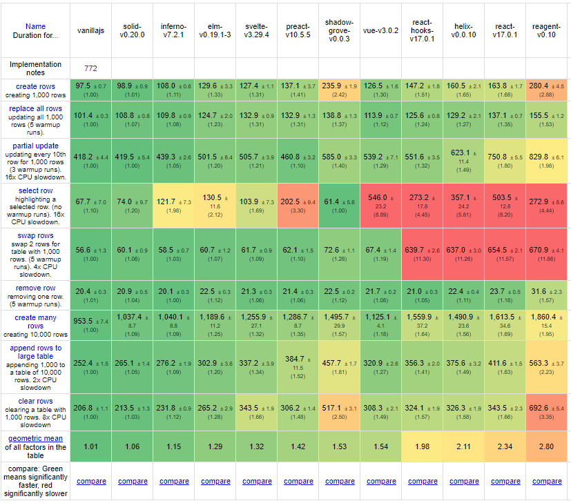

## 2021-03-01

Optimized `render-seq` a little more since we can exploit `identical?` checks to skip some work. Mostly affects `light` variant since that has to `render-seq` in `select row`.

### full

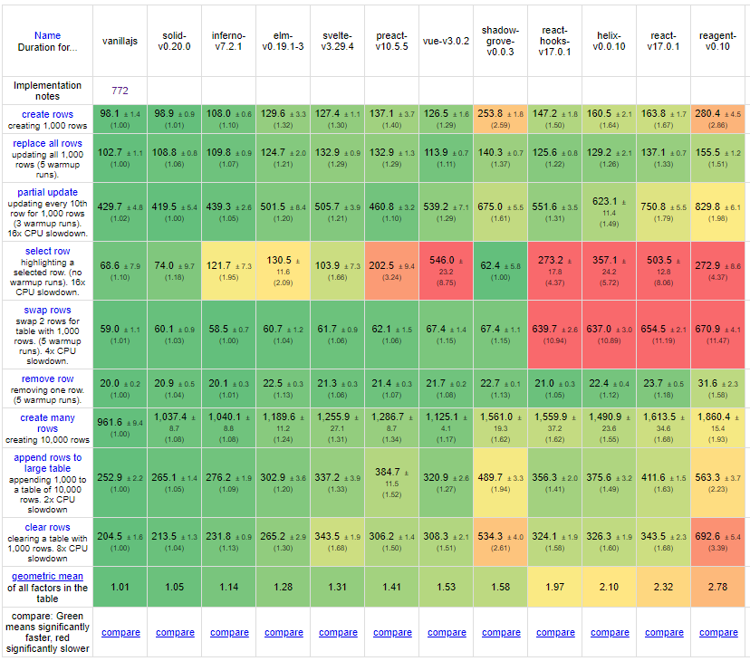

### light

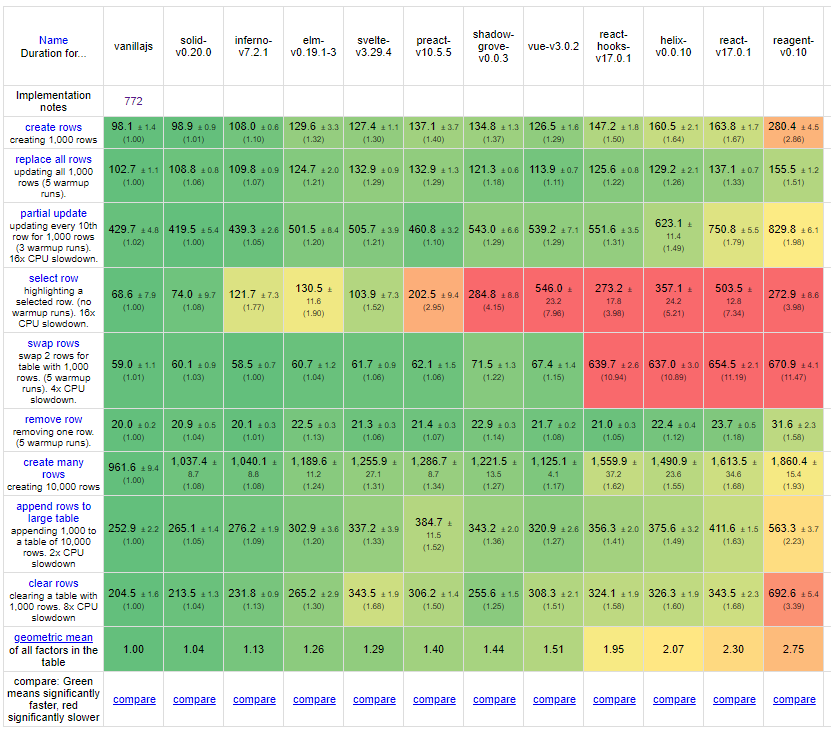

## 2021-02-27

Saw another easy win in `clear rows` and couldn't resist taking it. Seems to be at the point where now more time is spent in event data processing than any DOM related update work.

### full

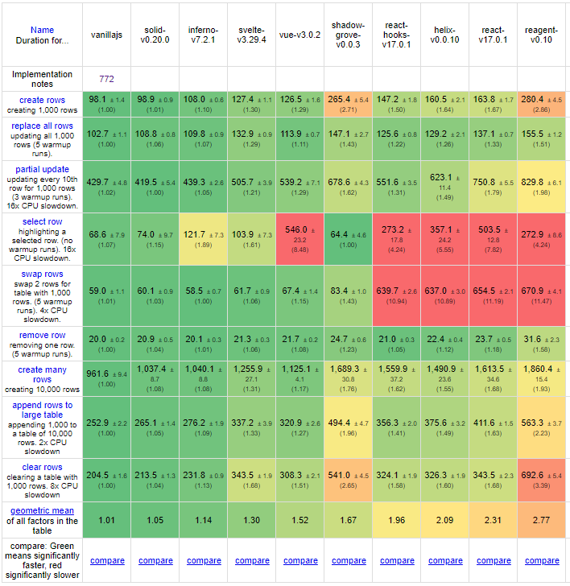

### light

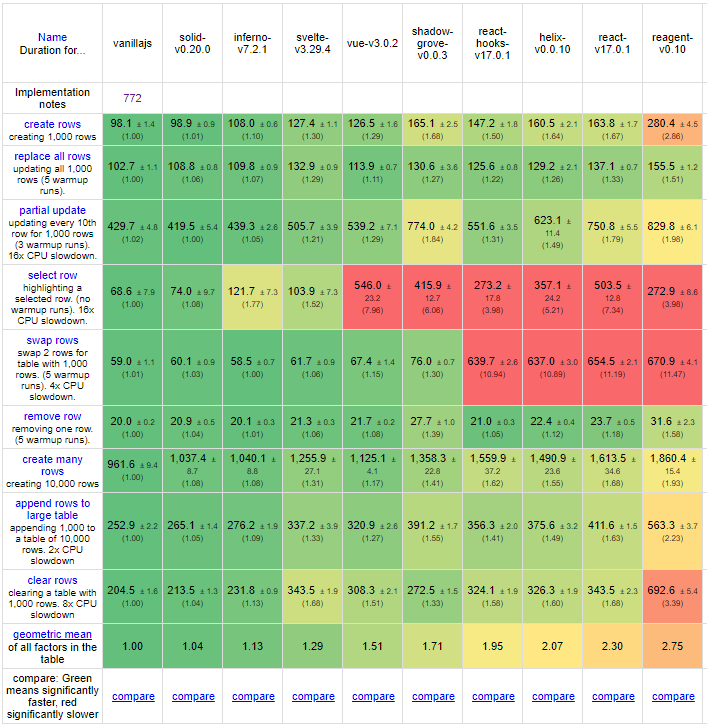

## 2021-02-27

One more. Realized that all query indexing work can be delayed and moved it to async queue. Minor gain overall but I'll take it.

### full

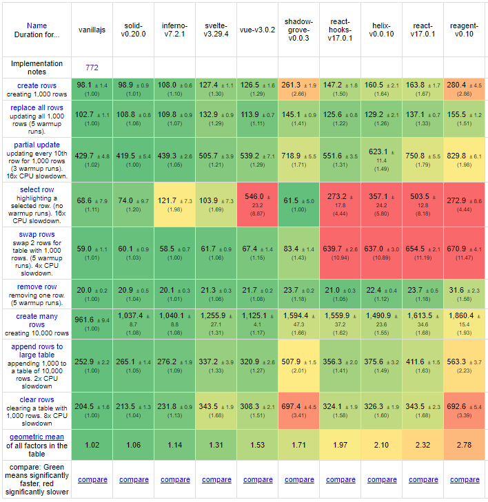

### light

unchanged since it doesn't use EQL queries

## 2021-02-26

Happy with performance for now. Added a couple more impls for comparison. Any CLJS impls I missed?

- `full` variant pays for faster update cycles by having slower mount/unmount since it has to hook up the EQL queries. There is lots of room left to make that faster overall.
- `light` variant doesn't do EQL but `select row` is rather slow. Mostly of time is spent in `render-seq`. Likely that can be tweaked more but good enough for now. Easily escaped by skipping `render-seq` entirely and updating row directly as EQL variant does.

### full

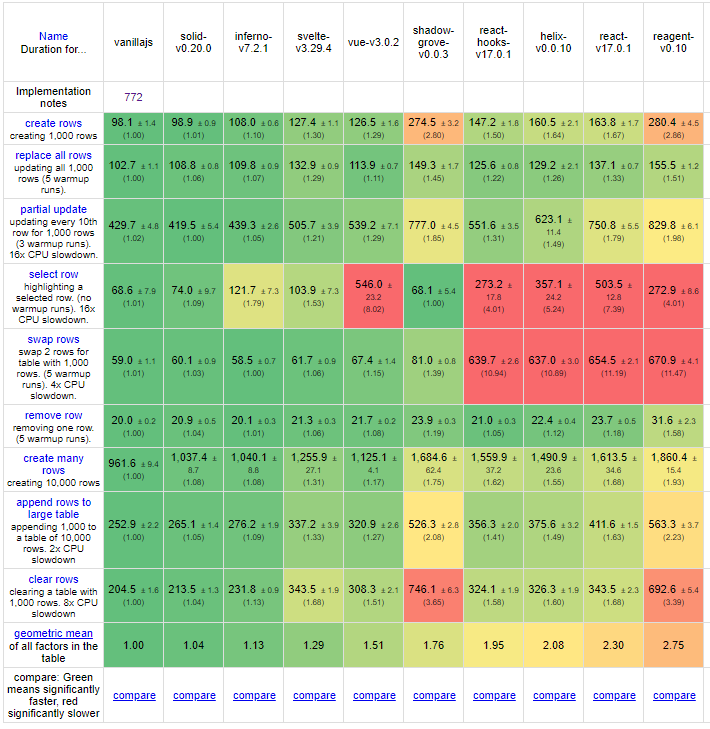

### light

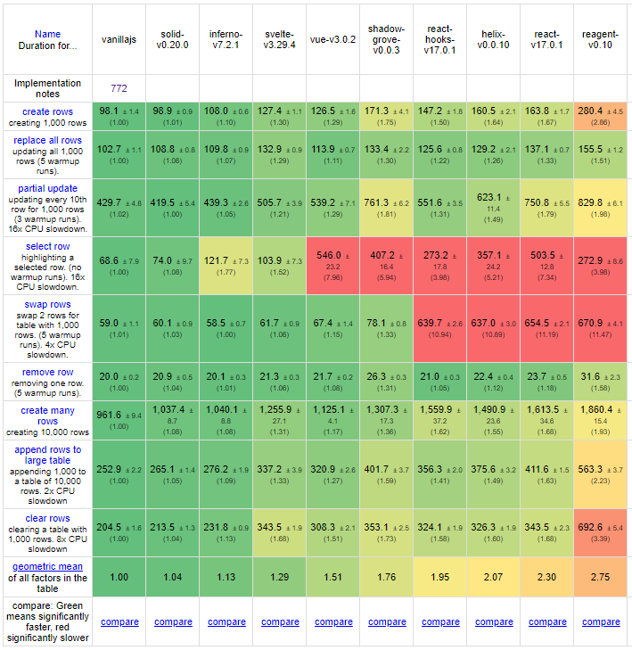

## 2021-02-25

Things look better with optimized `render-seq`. Now just need to get query indexing to a decent state and I'm happy with the performance.

Light variant still about same overall score. Trades faster create/clear for `select row` being much slower. Didn't optimize the actual diffing that occurs there yet. Full doesn't need to diff because it knows which rows were modified, that's were the power of the normalized DB really shines.

To be honest those numbers already look much much better than anticipated. Almost suspiciously so. Need some kind of better real-world related benchmark but things seem to be at the point where it matters much more what the app does than the underlying core algos.

### full

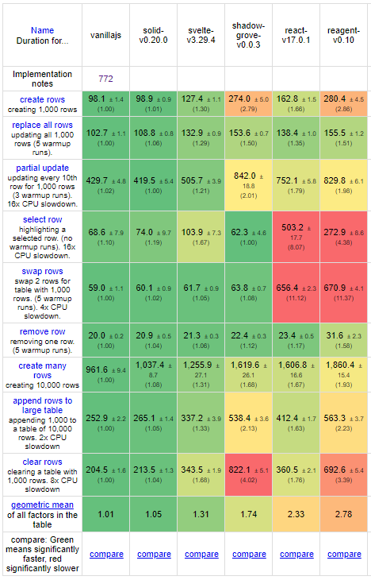

## 2021-02-24

Added a `light` variant that doesn't use any normalized DB or EQL queries. Faster in some aspects actually slower in others. Suffers greatly from `render-seq` behavior being bad. `full` variant actually surprisingly good.

### light
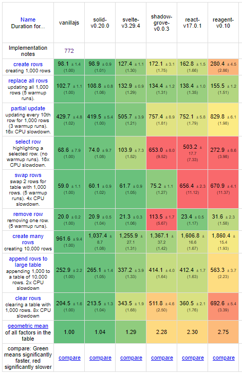

### full
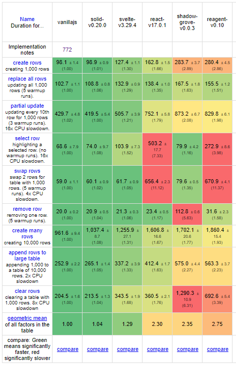

- create (many) rows: expected to be slow because of setting up and running the EQL to get the data
- replace all rows: I guess the warmup makes all the difference here. no clue how it could be faster than create otherwise
- partial update: decent, slow because of EQL queries 
- select row: fast since computation is done in event handler instead of dynamic EQL attribute
- swap rows: only has to update a vector via assoc (fast) and then swap two DOM nodes (also fast)
- remove row: `render-seq` behavior terrible for removals
- append: expected this to be slower but I guess it had enough warmup time when created the first 10,000.
- clear: most time spent in clearing up the normalized DB and EQL query machinery. actual DOM time is a tiny fraction.

## Older versions

This version had terrible `select row` performance because of a EQL computed attribute. Instead now calculating it once in the `::select!` event.

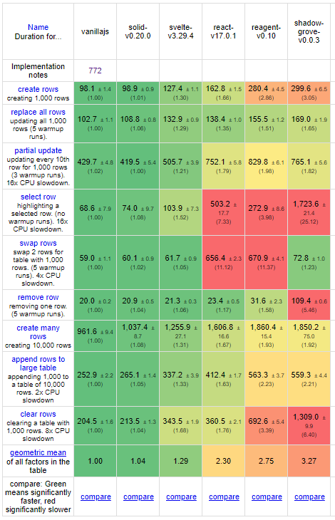
